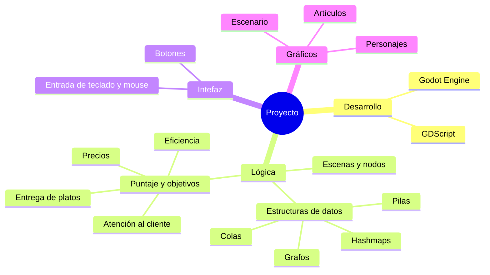
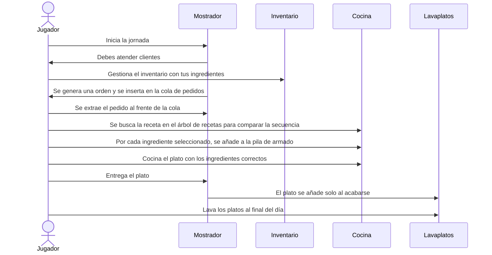

# Supa' Cooking
Este es nuestro proyecto final para estructuras de datos 2026-2: Un juego de cocina, implementado en Godot y enfocado en la implementación práctica de platos varios.

> [!NOTE]
>
> Integrantes del proyecto:
>
> - Hayran Andrés López
> - Daniel Alejandro Durán
> - Andrés Eduardo Sierra
> - Jeison Steven Guio
> - David Muñoz Muñoz

## Diseño

## Flujo de funcionamiento

