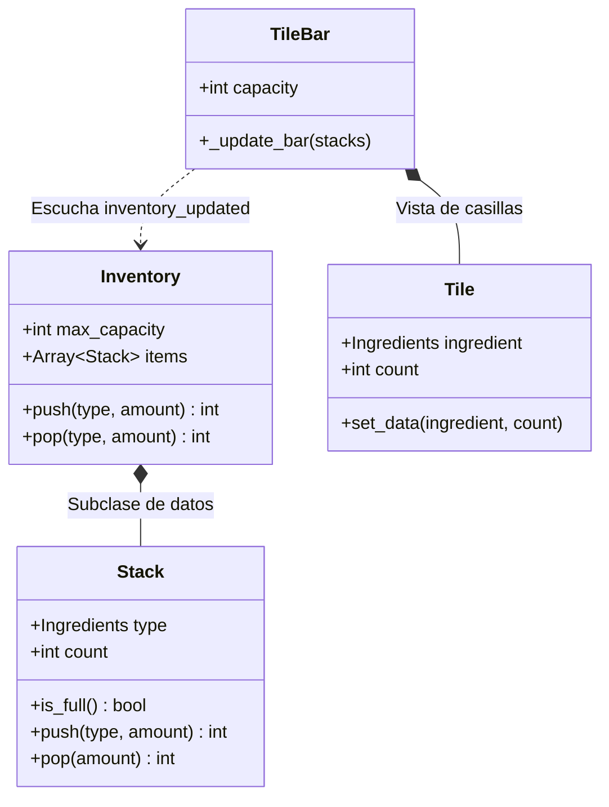

## Manejo de inventarios
Los inventarios se manejan con el siguiente esquema de clases:

```mermaid
classDiagram

class Inventory {
    +int max_capacity
    +Array~Stack~ items
    
    +push(type, amount) int
    +pop(type, amount) int
}

class Stack {
    +Ingredients type
    +int count
    
    +is_full() bool
    +push(type, amount) int
    +pop(amount) int
}

class TileBar {
    +int capacity

    +_update_bar(stacks)
}

class Tile {
    +Ingredients ingredient
    +int count
    
    +set_data(ingredient, count)
}

Inventory *-- Stack: Subclase de datos
TileBar *-- Tile: Vista de casillas
TileBar ..> Inventory: Escucha inventory_updated
```
